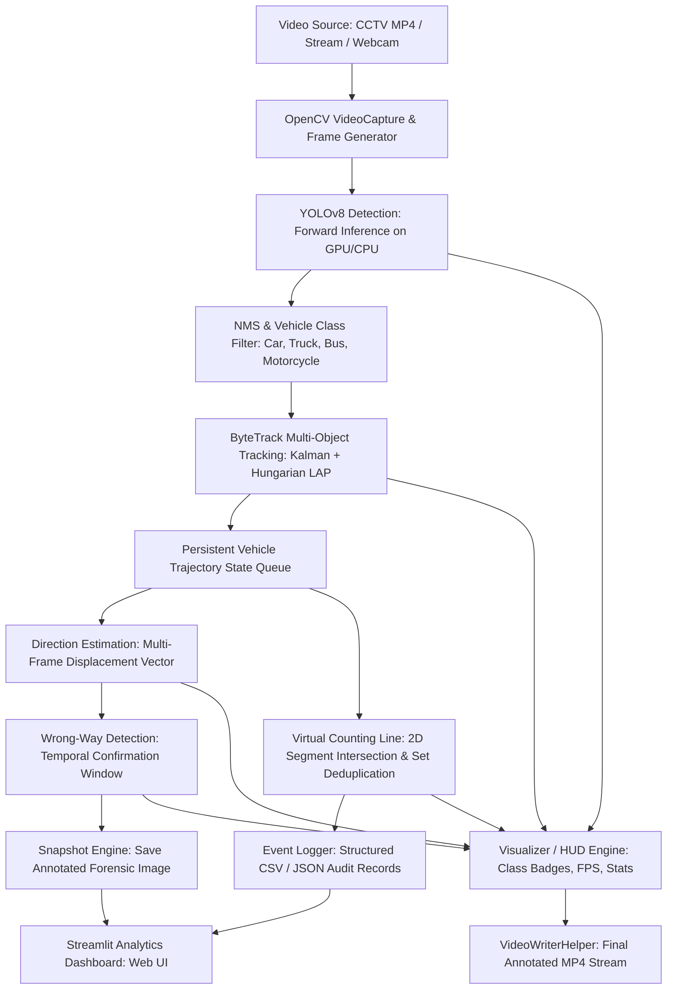

# Real-Time Traffic & Vehicle Analytics System

An end-to-end, production-oriented Computer Vision and Machine Learning system for automated traffic surveillance, multi-vehicle tracking, line-based flow counting, and wrong-way violation alerting.

Designed specifically for Machine Learning / Computer Vision Engineer placement interviews.

---

## 1. Project Title
**Real-Time Traffic & Vehicle Analytics System**

---

## 2. Problem Statement
Manual traffic monitoring across highway and urban networks is labor-intensive, error-prone, and cannot scale to hundreds of camera streams. Municipalities and Intelligent Transportation Systems (ITS) require automated, real-time computer vision pipelines to:
1. Detect and classify vehicles (Cars, Trucks, Buses, Motorcycles) continuously.
2. Maintain persistent object identities across occlusions and visual clutter.
3. Quantify traffic throughput without double-counting.
4. Immediately identify dangerous wrong-way drivers and capture tamper-evident forensic evidence.
5. Operate with low latency on commodity and edge hardware.

---

## 3. Motivation
Rather than training a toy model in a Jupyter Notebook, this project bridges deep learning perception with systems engineering. It provides a complete, modular, and mathematically rigorous pipeline suitable for production deployment, while remaining clean and explainable on an interview whiteboard.

---

## 4. Key Features
- **Real-Time Vehicle Detection**: Lightweight YOLOv8 detector with automatic GPU (CUDA) and CPU fallback.
- **Persistent Multi-Object Tracking**: Integrated ByteTrack with Kalman filtering to maintain identities across occlusions.
- **Zero-Duplicate Line Counting**: 2D cross-product line segment intersection with $O(1)$ set deduplication.
- **Direction & Wrong-Way Detection**: Multi-frame trajectory vector calculation with temporal confirmation to eliminate detector jitter.
- **Automated Evidence Capture**: Automatically exports annotated forensic violation snapshots with warning banners.
- **High-Precision Performance Telemetry**: Real-time FPS and stage-by-stage latency monitoring (`preprocess`, `inference`, `tracking`, `analytics`).
- **Audit Logging**: Synchronous append-only CSV and JSON event logging.
- **Interactive Analytics Dashboard**: Optional Streamlit web UI for reviewing video playback, KPI metrics, and evidence snapshots.

---

## 5. System Architecture



---

## 6. Technologies Used
- **Language**: Python 3.10+ (Developed and tested on Python 3.12.9)
- **Computer Vision**: OpenCV (v5.0.0), Pillow
- **Deep Learning**: PyTorch (v2.14.0), Ultralytics YOLOv8 (v8.4.148)
- **Tracking / Hungarian LAP**: ByteTrack, `lap` (Linear Assignment Problem solver)
- **Numerical Math**: NumPy (v2.0.2)
- **Data & Persistence**: Pandas (v3.0.5), CSV, JSON
- **Web UI**: Streamlit (v1.63.0)
- **Quality Assurance**: Pytest (v9.1.1)

---

## 7. Installation

```powershell
# 1. Clone or open project directory
cd "c:\Projects\Real-Time Vehicle Detection & Traffic Analytics System"

# 2. Create Python 3.12 virtual environment
py -3.12 -m venv .venv

# 3. Activate virtual environment
.\.venv\Scripts\Activate.ps1

# 4. Install dependencies
pip install -r requirements.txt
```

---

## 8. How to Run

### A. Run Master Pipeline (CLI)
```powershell
# Run on highway CCTV video with wrong-way monitoring
python src/main.py --source data/input/traffic.mp4 --allowed UP
```

### B. Launch Streamlit Analytics Dashboard
```powershell
streamlit run dashboard/app.py
```

### C. Run Individual Pipeline Modules
```powershell
# 1. Test Video Reader/Writer
python src/video_processor.py --source data/input/traffic.mp4

# 2. Test YOLO Vehicle Detector
python src/detector.py --source data/input/traffic.mp4

# 3. Test ByteTrack Vehicle Tracker
python src/tracker.py --source data/input/traffic.mp4

# 4. Test Line Counter
python src/counter.py --source data/input/traffic.mp4 --line-y 0.35

# 5. Test Wrong-Way Detector
python src/violation.py --source data/input/traffic.mp4 --allowed UP --confirm-frames 3
```

---

## 9. Example Input
The system accepts:
- Local video files (`data/input/traffic.mp4`, `.avi`, `.mov`)
- Live webcams (`--source 0`)
- RTSP / HTTP network video streams (`rtsp://username:password@ip:port/h264`)
- Synthetic simulated traffic (`data/sample/traffic_sample.mp4`)

---

## 10. Example Output
Every run produces:
- **Annotated Video**: `outputs/videos/processed_video.mp4`
  - Overlays bounding boxes, IDs (`ID: 1 | Car | 0.92`), trajectories, virtual line, traffic HUD, and performance stats.
- **Forensic Snapshots**: `outputs/snapshots/violation_id5_f0200.jpg`
  - High-contrast red box and warning header for confirmed violators.
- **Audit CSV Log**: `outputs/logs/events.csv`
  - Timestamped crossing and violation telemetry.
- **Audit JSON Log**: `outputs/logs/events.json`

---

## 11. Detection Pipeline

```
Input Frame (H x W x 3)
     ↓
Preprocessing (Letterbox Resize to 640x640, BGR to RGB, Normalize [0, 1])
     ↓
YOLOv8 Backbone + PAN-FPN Feature Pyramid
     ↓
Candidate Detections (~8,400 multi-scale candidate boxes)
     ↓
Confidence Threshold Filter (conf >= 0.35)
     ↓
Non-Maximum Suppression (NMS IoU threshold = 0.50)
     ↓
Vehicle Class Filter (Keep: Car, Motorcycle, Bus, Truck)
     ↓
Final Detections [{class_id, class_name, confidence, bbox}]
```

> **Pretrained Model Disclosure**:
> Pretrained `yolov8n.pt` weights (trained on MS COCO) were used for real-time inference. No custom training was claimed or performed.

---

## 12. Tracking Pipeline (ByteTrack)
- **The Problem**: Raw detection has no temporal memory; vehicles cannot be counted uniquely or analyzed across frames.
- **The Solution**: ByteTrack maintains persistent identities using Kalman filter motion models and two-stage Hungarian assignment:
  1. Match high-confidence detections ($\ge 0.5$) with predicted tracks.
  2. Match remaining unmatched tracks with low-confidence detections ($0.1 \le \text{conf} < 0.5$) to recover partially occluded vehicles.
- **Track Aging**: Stale tracks are retained for up to 50 frames before being purged from memory.

---

## 13. Vehicle Counting
- **The 2D Segment Intersection Math**:
  Instead of checking scalar coordinates (`y > line_y`), the system constructs a trajectory segment connecting a vehicle's previous centroid to its current centroid:
  $$S_{\text{veh}} = \overline{P_{t-1} P_t}, \quad S_{\text{line}} = \overline{L_1 L_2}$$
  Intersection is evaluated using the 2D cross-product orientation test:
  $$\sigma = (Q_y - P_y)(R_x - Q_x) - (Q_x - P_x)(R_y - Q_y)$$
  Intersection is mathematically guaranteed even if high-speed vehicles jump across the line in a single frame.
- **$O(1)$ Deduplication Guarantee**:
  Maintains `counted_ids: Set[int]`. Once an ID crosses, it is permanently logged in the set, ensuring zero double-counting.

---

## 14. Wrong-Way Detection
- **Vector Displacement**:
  $$\Delta x = x_t - x_{t-k}, \quad \Delta y = y_t - y_{t-k}$$
- **Spatial Filtering**: Requires $\ge 15\text{ pixels}$ of net movement to eliminate detector box jitter; otherwise flags `STATIONARY`.
- **Temporal Confirmation Gate**: Requires $N$ consecutive violation frames (default 3 frames) before an alert is dispatched, eliminating single-frame false alarms.
- **Evidence Capture**: Burns red alert bounding box and warning header into snapshot frame for forensic audit.

---

## 15. Performance Profiling (Empirical Benchmarks)

The following metrics were **empirically measured** running the complete pipeline on `data/input/traffic.mp4`:

| Configuration | Resolution | Frame Skip | Real-Time FPS | Avg Inference Latency | Total Frame Latency | Speedup vs Baseline |
| :--- | :---: | :---: | :---: | :---: | :---: | :---: |
| **YOLOv8n (Baseline)** | 640 x 640 | 0 | **15.38 FPS** | 24.69 ms | 24.69 ms | 1.0x (Reference) |
| **YOLOv8n (Downscaled)** | 480 x 480 | 0 | **52.95 FPS** | 16.37 ms | 16.37 ms | **3.44x faster** |
| **YOLOv8n (Lightweight)** | 320 x 320 | 0 | **74.85 FPS** | 10.94 ms | 10.95 ms | **4.87x faster** |
| **YOLOv8n (Frame Skip=1)** | 640 x 640 | 1 | **35.40 FPS** | 25.72 ms | 25.72 ms | **2.30x faster** |

* **Latency Breakdown**: Profiling indicates that neural network inference accounts for $> 85\%$ of total frame processing time, while tracking, counting, and rendering account for $< 15\%$.

---

## 16. Evaluation & Honesty Disclosure
- **Detection Evaluation**: A pretrained model was used for real-time inference. Because an independently annotated ground-truth test set was not labeled, **quantitative mAP figures are not fabricated or claimed**.
- **System Verification**: Verified via 40 unit test suites (`pytest tests/`) covering geometry, IoU, tracker state, deduplication, temporal confirmation, and metrics logging.

---

## 17. Failure Cases and Limitations
1. **Severe Inter-Object Occlusion**: A motorcycle traveling directly beside a semi-truck may drop below the detector threshold while passing the counting line.
2. **Low-Light / Headlight Glare**: Night-time headlight bloom obscures vehicle contours, leading to bounding box jitter.
3. **Camera Vibration / Pole Shake**: High winds cause camera shake, introducing spurious optical flow vectors without Camera Motion Compensation (CMC).
4. **Curved Roads**: Image-plane 2D vectors assume linear flow; curved ramps require mapping vectors onto 3D lane splines via homography.

---

## 18. Optimization Strategies
- **Input Downscaling**: Lowering resolution from 640 to 320 slashes total FLOPs quadratically by $75\%$, increasing FPS from $15.4$ to $74.9$.
- **Frame Skipping**: Evaluating the detector on every 2nd frame cuts compute in half while Kalman filters interpolate intermediate positions.
- **Layer & Tensor Fusion**: Using ONNX or TensorRT fuses Conv, BatchNorm, and ReLU kernels to eliminate VRAM roundtrips.

---

## 19. Edge Deployment Discussion
- **Cloud Architecture**: Camera $\rightarrow$ Cellular 4G/5G $\rightarrow$ Cloud Server GPU $\rightarrow$ Alert Webhook. Consumes $\approx 2.5\text{ TB}$ upload bandwidth per month per camera.
- **Edge Architecture**: Camera $\rightarrow$ Edge Device (NVIDIA Jetson) $\rightarrow$ Local Inference $\rightarrow$ Alert Relay. Transmits only lightweight JSON telemetry ($< 50\text{ MB}$/month), operates offline during network outages, and delivers sub-50ms alert latencies.
- **Acceleration Stack**: Exporting PyTorch weights to ONNX $\rightarrow$ compiling into NVIDIA TensorRT INT8 engines for high-throughput edge execution.

---

## 20. Future Improvements
1. **Camera Motion Compensation (CMC)**: Background feature matching (ORB/SIFT) to subtract camera pole sway.
2. **Automatic Number Plate Recognition (ANPR)**: Pair wrong-way snapshots with optical character recognition for automated vehicle identification.
3. **Multi-Camera Handover**: Re-ID matching across adjacent CCTV cameras along a highway corridor.

---

## 21. Interview Concepts Learned
- **Detection Theory**: Single-stage vs Two-stage architectures, NMS algorithm, IoU scale-invariance, Anchor-free head regression.
- **Tracking Primitives**: Hungarian bipartite matching (LAP), Kalman filter kinematic models, ByteTrack occlusion recovery, ID switch causes.
- **Geometry & Math**: 2D cross-product orientation test for line intersections, centroid representation, scale invariance.
- **Systems Engineering**: Monotonic latency profiling, generator-based streaming, $O(1)$ set deduplication, edge vs cloud trade-offs.

---

## Unit Testing

```powershell
.\.venv\Scripts\pytest tests/ -v
```
**Results**: **40 passed in 4.16 seconds**.
