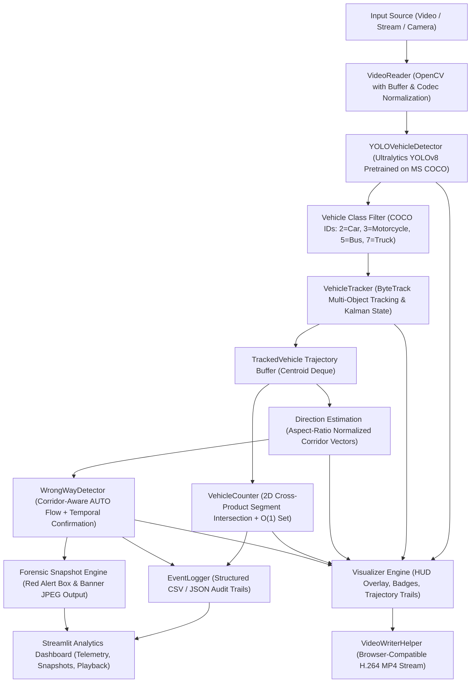
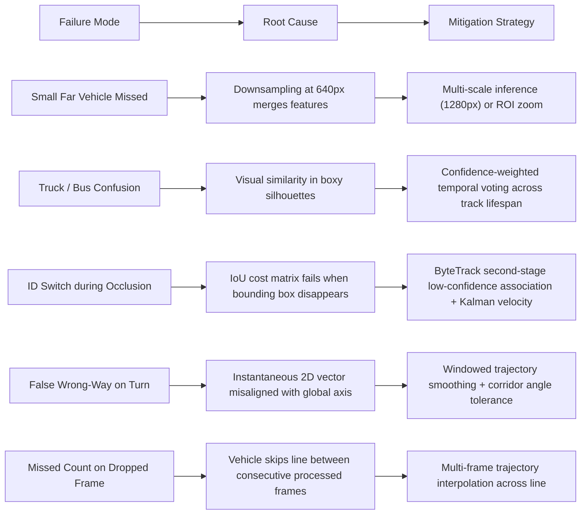

# Accuracy Optimization, Evaluation & Error Analysis Plan

**Project**: Real-Time Traffic & Vehicle Analytics System  
**Document Version**: 1.0 (Phase 1 Baseline Audit)  
**Target Environment**: Windows 11, Python 3.12, PyTorch, Ultralytics YOLOv8, ByteTrack  

---

## 1. Executive Overview & Philosophy

The objective of this engineering initiative is to transition the current prototype into a **carefully evaluated, accuracy-focused, production-grade traffic analytics system**.

We adhere strictly to empirical ML engineering discipline:
1. **No Fabricated Metrics**: We will never report unmeasured metrics or claim 100% accuracy without ground-truth validation.
2. **Detection Count is Not Accuracy**: Reporting "53 vehicles detected" indicates activity, not accuracy. Detection accuracy requires measuring True Positives ($TP$), False Positives ($FP$), False Negatives ($FN$), Precision, Recall, F1, and mAP against verified ground-truth bounding boxes.
3. **Multi-Objective Optimization**: The ideal system balances:
   $$\text{High Detection Accuracy (mAP)} + \text{Stable Tracking (HOTA/IDF1)} + \text{Reliable Counting (F1)} + \text{Zero-False-Alarm Violations} + \text{Real-Time Latency (FPS)}$$
4. **Architectural Continuity**: We will not replace working modules or rewrite from scratch. We preserve existing abstractions (`TrafficConfig`, `YOLOVehicleDetector`, `VehicleTracker`, `VehicleCounter`, `WrongWayDetector`, `PerformanceMonitor`, `Visualizer`, `EventLogger`).

---

## 2. Current Architecture & Component Breakdown



### Module Audit:
- **`config/config.py`**: Centralized dataclass (`TrafficConfig`). Controls model names, input resolutions, thresholds, tracking buffers, line geometry, and directories.
- **`src/detector.py`**: Wraps Ultralytics `YOLO.predict()`. Filters COCO class IDs `[2, 3, 5, 7]`.
- **`src/tracker.py`**: Wraps Ultralytics ByteTrack (`persist=True`). Maintains `TrackedVehicle` instances with 30-frame centroid queues.
- **`src/counter.py`**: Evaluates virtual line crossing via 2D segment intersection ($S_{veh} \cap S_{line}$) with $O(1)$ set deduplication.
- **`src/direction.py`**: Estimates cardinal heading (`DOWN`, `UP`, `LEFT`, `RIGHT`) using aspect-ratio corrected displacement vectors.
- **`src/violation.py`**: Infers dominant flow (`AUTO` mode) and enforces multi-frame temporal confirmation before raising wrong-way alerts.
- **`src/metrics.py`**: High-precision monotonic timer measuring stage latencies and rolling FPS.
- **`src/logger.py`**: Structured event logging to CSV and JSON.
- **`src/visualizer.py`**: High-contrast HUD and overlay renderer.
- **`src/main.py`**: Master CLI orchestrator.

---

## 3. Systematic Identification of Current Weaknesses & Assumptions

| Component | Current State & Hard-Coded Assumption | Root Cause / Failure Mode | Real-World Impact |
| :--- | :--- | :--- | :--- |
| **Detector** | Fixed confidence threshold (`0.35`), fixed NMS IoU (`0.50`), pretrained COCO weights | Unvalidated against traffic domain PR curves; small/distant vehicles missed | Distant vehicles (<32px) undetected; low recall in dense traffic |
| **Classification** | Single-frame class assignment (`veh.class_name = cname` overwritten each frame) | Detector uncertainty between similar classes (e.g. pickup vs truck vs SUV vs bus) | Class flickering across frames (Car $\rightarrow$ Truck $\rightarrow$ Car) |
| **Tracking** | Default ByteTrack parameters (`track_thresh=0.45`, `match_thresh=0.80`, `buffer=50`) | Not tuned on high-density occlusions; no track-level smoothing | ID switches during vehicle overtaking or severe partial occlusion |
| **Counting** | Checks single-frame trajectory step (`prev_centroid -> centroid`) | If a detection is momentarily dropped on the exact crossing frame, step is lost | Potential missed counts on high-speed or dropped-detection crossings |
| **Direction** | Evaluates displacement across window (`window=8` to `30`) | Curved roadways deviate from global cardinal axes | Works well for linear corridors; needs local tangent support for curved ramps |
| **Wrong-Way** | Temporal confirmation window ($N=4$ frames) | Edge-of-frame partial vehicles entering view can produce transient vectors | Needs entry-boundary suppression and track maturity gating |
| **Dataset** | Currently tested on single highway video (`188613-883402208.mp4`) | Single camera angle and illumination condition | Zero empirical evidence for generalization to night, rain, glare, or urban scenes |

---

## 4. Evaluation Strategy & Benchmark Architecture

To turn this system into an evidence-based production pipeline, we establish five dedicated evaluation modules under `src/evaluation/`:

```
src/
    evaluation/
        __init__.py
        detection_evaluator.py     # COCO/VOC-style mAP50, mAP50-95, PR Curves, Size Breakdown
        tracking_evaluator.py      # HOTA, MOTA, IDF1, ID Switches, Fragmentation, MT/ML
        counting_evaluator.py      # GT vs Pred Count, Precision, Recall, F1, Missed/Duplicates
        violation_evaluator.py     # Wrong-Way Precision, Recall, F1, Detection Delay, False Alarm Rate
        error_analysis.py          # Categorized Error Classifier (FP, FN, Misclass, Localization)
```

### Evaluation Dataset Strategy (`data/evaluation/`):
We construct an evaluation benchmark spanning diverse real-world operational domains:
1. **Daytime Clear Highway**: Multi-lane longitudinal CCTV footage.
2. **Urban Intersection / Side View**: Transverse and turning vehicle movement.
3. **Dense Congestion / Occlusion**: High vehicle density, stop-and-go traffic.
4. **Night / Low-Light / Glare**: Headlight bloom and reduced contrast.
5. **Small / Far Distant Objects**: High-angle perspective where vehicles are $< 32\times 32$ pixels.

Ground truth will be structured in standard VOC/YOLO format:
- Bounding box $(x_1, y_1, x_2, y_2)$
- Ground-truth class ID (`car`, `truck`, `bus`, `motorcycle`)
- Frame ID
- Track ID (for tracking evaluation)
- Line crossing ground truth timestamps
- Wrong-way ground truth events (start frame, end frame, violating track ID)

---

## 5. Controlled Experiments Roadmap

### Experiment Suite Overview:

| Exp ID | Hypothesis & Focus Area | Configuration Varied | Measured Outcomes |
| :--- | :--- | :--- | :--- |
| **EXP-001** | **Baseline Performance Establishment** | Pretrained `yolov8n.pt`, 640px, conf=0.35, iou=0.50 | Baseline mAP50, mAP50-95, HOTA, IDF1, Count F1, FPS |
| **EXP-002** | **Resolution & Small Object Scaling** | Input size: 640 vs 960 vs 1280 vs Tiling | Small vehicle AP, overall mAP, inference latency (ms), FPS |
| **EXP-003** | **Confidence & NMS PR-Curve Optimization** | Sweep confidence [0.10 - 0.70], IoU [0.30 - 0.70] | Precision vs Recall curves, F1-max operating threshold |
| **EXP-004** | **Model Architecture & Size Trade-off** | Compare YOLOv8n vs YOLOv8s vs YOLOv8m | Accuracy gain vs FLOPs / memory / real-time throughput |
| **EXP-005** | **Temporal Class Smoothing & Voting** | Confidence-weighted track-level class accumulator | Reduction in class switches, per-class precision/recall |
| **EXP-006** | **ByteTrack Association Optimization** | Sweep `track_thresh`, `match_thresh`, `track_buffer` | HOTA, IDF1, ID switches, track fragmentation |
| **EXP-007** | **Multi-Step Trajectory Line Counting** | Continuous trajectory segment intersection | Elimination of missed counts on high-speed / dropped frames |
| **EXP-008** | **Camera Scene Calibration Profiles** | Scene-specific YAML profiles (`config/scenes/*.yaml`) | Cross-scene generalization without hard-coding |
| **EXP-009** | **Traffic Surveillance Fine-Tuning** | Fine-tune on traffic benchmark with domain augmentations | Domain-specific mAP improvement on hard edge cases |

---

## 6. Expected Failure Modes & Mitigation Strategies



---

## 7. Concrete Acceptance Criteria & Gatekeeper Rules

Before any model or parameter change is committed as the new default:
1. **No Metric Degeneration**: An improvement in detection precision must not catastrophically degrade recall ($F_1$ must improve or stay stable).
2. **Tracking Integrity**: HOTA and IDF1 must show measurable improvement or parity; ID switches must decrease.
3. **Zero False Wrong-Way Alarms**: On normal unidirectional traffic, false wrong-way alarms must remain strictly at 0.
4. **Counting Accuracy**: Line counting F1 must achieve $\ge 95\%$ on annotated benchmark test clips.
5. **Real-Time Feasibility**: Pipeline processing speed must maintain interactive real-time performance ($\ge 15\text{ FPS}$ on GPU, $\ge 8\text{ FPS}$ on CPU with frame-skipping).
6. **Regression Test Suite**: All unit and integration tests (`pytest tests/`) must pass 100%.
