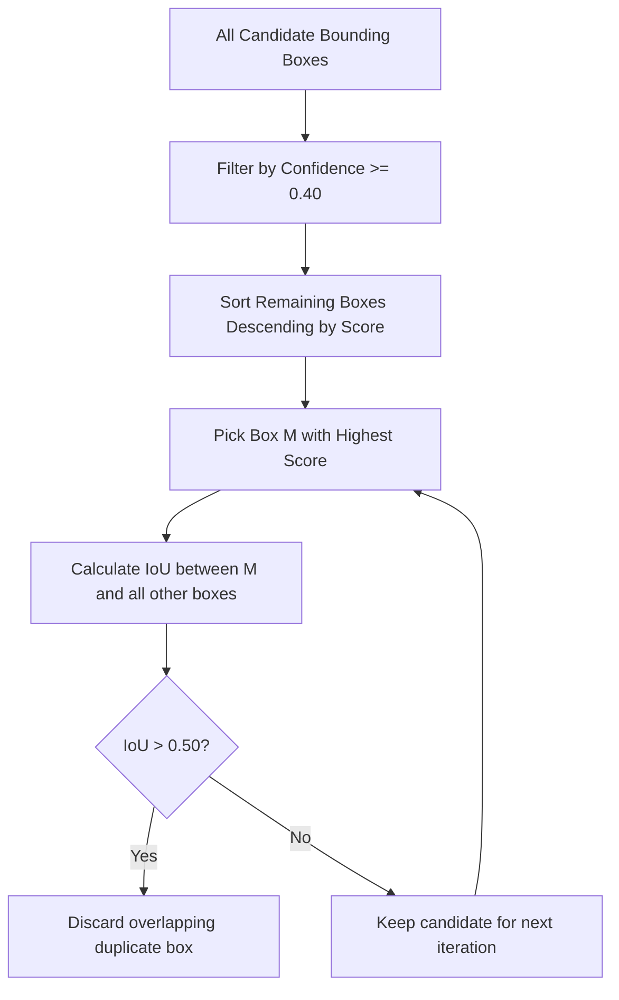

# YOLO Vehicle Detection Pipeline: Technical Guide & Whiteboard Concepts

---

## 1. Pipeline Overview

```
Input Video Frame (H x W x 3 BGR)
       ↓
Preprocessing & Letterbox Resizing (e.g. 640 x 640)
       ↓
YOLOv8 Convolutional Backbone + C2f Feature Pyramid Network (PAN-FPN)
       ↓
Anchor-Free Detection Head (Multi-scale Feature Maps P3, P4, P5)
       ↓
Raw Candidate Detections (~8,400 candidate bounding boxes)
       ↓
Confidence Threshold Filtering (Eliminate boxes where conf < threshold)
       ↓
Non-Maximum Suppression (NMS) (Eliminate overlapping duplicate boxes with IoU > threshold)
       ↓
Class Filtering (Filter target vehicle classes: Car, Motorcycle, Bus, Truck)
       ↓
Final Structured Detections [{class_id, class_name, confidence, bbox}]
```

---

## 2. Core Concepts: WHAT, WHY, and HOW

### A. What is YOLO (You Only Look Once)?
* **WHAT**: YOLO is a family of **single-stage** deep learning object detection models that formulate object detection as a single regression problem—predicting bounding box coordinates and class probabilities directly from full image pixels in a single forward pass.
* **WHY**: Traditional multi-stage detectors (like Faster R-CNN) first generate 2,000 region proposals using a Region Proposal Network (RPN) and then classify each region separately, which is computationally expensive (typically 5–15 FPS). YOLO evaluates the entire image globally in one network pass, enabling **real-time inference** (30–120+ FPS on edge/consumer hardware).
* **MODEL USED**: In this project, we utilize the pretrained **YOLOv8n (nano)** model provided by Ultralytics, trained on the standard MS COCO dataset (80 common object categories).
  > **Academic / Placement Honesty**: The model weights were **not trained from scratch by us**. We use the pretrained model out-of-the-box for real-time inference and engineer the downstream tracking, counting, trajectory analysis, violation detection, and performance pipelines.

---

### B. Classification vs. Object Detection vs. Instance Segmentation
| Task | Question Answered | Output Format | Computational Complexity |
| :--- | :--- | :--- | :--- |
| **Image Classification** | "What is in this entire image?" | Single class label + probability (e.g., `car: 0.95`) | Lowest ($O(1)$ output vector) |
| **Object Detection** | "What objects are present, and **where** are they?" | List of bounding boxes $(x_1, y_1, x_2, y_2)$ + class + confidence | Moderate (dense candidate grid regression) |
| **Instance Segmentation** | "Which exact pixels belong to each individual object?" | Pixel-level binary masks + bounding boxes | Highest (pixel-wise mask segmentation) |

* **Interview Whiteboard Takeaway**: Classification tells you a car exists somewhere in the frame. Object detection tells you *which lane* the car occupies and its spatial boundaries, which is the minimum requirement for vehicle tracking and virtual line crossing.

---

### C. What is a Bounding Box?
A bounding box is the smallest rectangular enclosing boundary that tightly bounds an object in 2D image pixel space.

Two standard mathematical coordinate representations are used:
1. **Corner Representation ($xyxy$)**:
   $$(x_1, y_1, x_2, y_2)$$
   Where $(x_1, y_1)$ is the top-left coordinate and $(x_2, y_2)$ is the bottom-right coordinate.
2. **Center-Size Representation ($xywh$)**:
   $$(x_c, y_c, w, h)$$
   Where $(x_c, y_c)$ is the box centroid, $w$ is box width, and $h$ is box height.
   $$\text{Conversion}: \quad x_c = \frac{x_1 + x_2}{2}, \quad y_c = \frac{y_1 + y_2}{2}, \quad w = x_2 - x_1, \quad h = y_2 - y_1$$

In our system, we store coordinates in **pixel space** $(x_1, y_1, x_2, y_2)$ for direct OpenCV rendering, and dynamically compute centroid $(x_c, y_c)$ for trajectory tracking.

---

### D. What Does the Confidence Score Mean?
In YOLO, the confidence score represents:
$$\text{Confidence} = P(\text{Object}) \times \text{IoU}_{\text{pred}}^{\text{ground\_truth}}$$
For each detected box, the model outputs:
1. The probability that an object actually exists within the candidate box ($P(\text{Object})$).
2. The conditional probability of each class given an object is present ($P(\text{Class}_i \mid \text{Object})$).

The final score for class $i$ is:
$$\text{Score}_i = P(\text{Object}) \times P(\text{Class}_i \mid \text{Object}) = P(\text{Class}_i)$$
* **Tuning in this Project**: We configure `confidence_threshold = 0.40`. Setting this too low (e.g., $0.10$) causes false positives from background clutter (e.g., shadows or trees detected as vehicles). Setting it too high (e.g., $0.75$) causes false negatives on small or partially occluded distant vehicles.

---

### E. Intersection over Union (IoU)
IoU measures the degree of geometric overlap between two bounding boxes $A$ and $B$:
$$\text{IoU}(A, B) = \frac{\text{Area}(A \cap B)}{\text{Area}(A \cup B)} = \frac{\text{Area of Overlap}}{\text{Area}(A) + \text{Area}(B) - \text{Area}(A \cap B)}$$

* $\text{IoU} = 1.0$: Boxes are perfectly identical.
* $\text{IoU} = 0.0$: Boxes do not touch.
* **Why IoU is Scale-Invariant**: Regardless of whether a box is $20 \times 20$ pixels (distant motorcycle) or $400 \times 400$ pixels (nearby bus), IoU evaluates relative overlap proportionally without scale bias.

---

### F. Non-Maximum Suppression (NMS)
Because YOLO predicts candidate boxes across multiple feature map scales (e.g., 80x80, 40x40, 20x20 grids), a single vehicle often produces multiple candidate boxes overlapping the same object.

**The NMS Algorithm Step-by-Step**:
1. **Sort**: Sort all candidate boxes in descending order of their confidence score.
2. **Select Highest**: Select the box with the highest confidence score $M$ and add it to the final detections list.
3. **Suppress Overlaps**: Compare $M$ with all remaining candidate boxes. If $\text{IoU}(M, B_i) > \text{NMS Threshold}$ (e.g. $0.50$), discard $B_i$ as a duplicate.
4. **Repeat**: Repeat steps 2 and 3 for the remaining boxes until no candidate boxes remain.



---

### G. One-Stage vs. Two-Stage Detectors
| Metric | One-Stage Detectors (e.g., YOLO, SSD, RetinaNet) | Two-Stage Detectors (e.g., Faster R-CNN, Cascade R-CNN) |
| :--- | :--- | :--- |
| **Architecture** | Single CNN network directly predicts bounding box offsets and class probabilities. | **Stage 1**: Region Proposal Network (RPN) suggests candidate regions.<br>**Stage 2**: RoI Pooling + Classification/Bounding Box Regression heads. |
| **Speed / FPS** | **High** (30 – 150+ FPS) — Ideal for real-time edge CCTV streams. | **Low** (5 – 15 FPS) — Struggles on edge devices without heavy server GPUs. |
| **Small Object Accuracy** | Historically lower, though modern YOLOv8 Feature Pyramids have closed the gap. | Marginally higher on ultra-dense crowds or tiny objects due to two-step feature cropping. |
| **Choice in Our System** | **YOLOv8** was chosen because real-time traffic analysis requires at least 25–30 FPS throughput to calculate accurate velocity vectors. |

---

## 3. Real-World Limitations & Failure Cases
1. **Severe Occlusion**: When a large truck blocks the camera line-of-sight to an adjacent motorcycle, the motorcycle's bounding box may drop below the confidence threshold for several frames.
2. **Low-Light / Night Traffic**: Headlight glare at night creates bloom effects that distort vehicle edge contours, causing bounding boxes to fluctuate.
3. **Camera Angle Perspective**: High steep overhead cameras (bird's eye view) change vehicle visual profiles dramatically compared to ground-level CCTV cameras, reducing pretrained COCO detection recall.

---

## 4. Key Placement Interview Questions on Detection
1. **Why does YOLOv8 not use Anchor Boxes?**
   * *Answer*: Earlier versions (YOLOv3/v4/v5) used predefined anchor boxes of fixed aspect ratios clustered via K-means on the training set. YOLOv8 is **anchor-free**: it predicts the distance from the grid cell center to the 4 bounding box edges directly. This eliminates complex anchor tuning hyperparameters and generalizes better across varied object scales.
2. **What happens if NMS IoU threshold is set too low (e.g. 0.1) vs. too high (e.g. 0.9)?**
   * *Answer*: If set too low ($0.1$), two different vehicles driving close together side-by-side will have one vehicle mistakenly suppressed and eliminated. If set too high ($0.9$), duplicate bounding boxes for the same single vehicle will survive, leading to double-counting and ghost tracks.
3. **How does YOLO achieve multi-scale detection?**
   * *Answer*: YOLO utilizes a Feature Pyramid Network (PAN-FPN). Shallow feature maps (e.g., $80 \times 80$) have fine spatial detail suitable for detecting small objects (distant motorcycles). Deep feature maps (e.g., $20 \times 20$) have high semantic receptive fields suitable for detecting large objects (nearby trucks).
